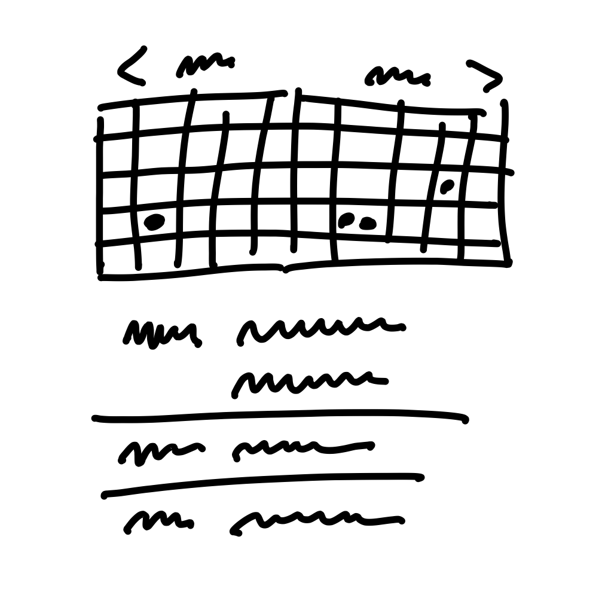

# Principles of Shaping

When we shape the work, we need to do it at the right level of abstraction: not too vague and not too concrete. Product managers often err on one of these two extremes.

## Wireframes are too concrete

When design leaders go straight to wireframes or high-fidelity mockups, they define too much detail too early. This leaves designers no room for creativity. One friend put it this way:

> I’ll give a wireframe to my designer, and then I’m saying to her: “I know you’re looking at this, but that’s not what I want you to design. I want you to re-think it!” It’s hard to do that when you’re giving them this concrete thing.

Over-specifying the design also leads to estimation errors. Counterintuitive as it may seem, the more specific the work is, the harder it can be to estimate. That’s because making the interface _just so_ can require solving hidden complexities and implementation details that weren’t visible in the mockup. When the scope isn’t variable, the team can’t reconsider a design decision that is turning out to cost more than it’s worth.

## Words are too abstract

On the other end of the spectrum, projects that are too vague don’t work either. When a project is defined in a few words, nobody knows what it means. “Build a calendar view” or “add group notifications” sound sensible, but what exactly do they entail? Team members don’t have enough information to make trade-offs. They don’t know what to include or leave out. A programmer who worked in that situation said:

> You’re solving a problem with no context. You have to be a mind reader. It’s like: “we’ll know it when we see it.”

Concerning estimation, under-specified projects naturally grow out of control because there’s no boundary to define what’s out of scope.

## Case study: The Dot Grid Calendar

Let’s look at an example of how to shape a project at the right level of detail.

We launched version three of Basecamp without a calendar feature. It had a “schedule” feature that just listed events one after the other without any kind of monthly, weekly or daily grid.

Soon after launch, customers started asking us to “add a calendar” to Basecamp. We had built calendars before and we knew how complex they are. It can easily take six months or more to build a proper calendar.

These are the kinds of things that make a calendar complicated:

- Dragging and dropping events between cells to move them
- Wrapping multi-day events around the edge of the screen
- Different views for monthly, weekly, or daily time scales
- Dragging the edge of an event to change its duration
- Color coding events for different categories
- Handling different expectations for desktop vs. mobile interactions

Past versions of Basecamp had calendars, and only about 10% of customers used them. That’s why we didn’t have the `appetite` for spending six months on a calendar. On the other hand, if we could do something to satisfy those customers who were writing us in one six week cycle, we were open to doing that.

With only six weeks to work with, we could only build about a tenth of what people think of when they say “calendar.” The question became: which tenth?

We did some research (discussed in the next chapter) and narrowed down a use case that we wanted to solve. We eventually arrived at a promising concept inspired by calendars on phones. We could build a two-month, read-only grid view. Any day with an event would have a dot for each event. A list of events would appear below the calendar, and clicking a day with a dot would scroll the events for that day into view. We called it the Dot Grid.

The Dot Grid wasn’t a full-featured calendar. We weren’t going to allow dragging events between days. We weren’t going to span multi-day events across the grid; we’d just repeat the dots. There’d be no color coding or categories for events. We were comfortable with all these trade-offs because of our understanding of the use case.

This is the level of fidelity we used to define the solution:

*Rough sketch of the Dot Grid concept*

Note how rough the sketch is and how many details are left out. The designer had a lot of room to interpret how this should look and feel.

At the same time, note how specific the idea is. It’s very clear how it works, what needs to be built, what’s in and what’s out.

At the end of the project, the finished work that the designers and programmers created looked like this:

*Screenshot of the Dot Grid when it launched*

This small example highlights a few properties of shaped work.

## Property 1: It’s rough

Work in the shaping stage is rough. Everyone can tell by looking at it that it’s unfinished. They can see the open spaces where their contributions will go. Work that’s too fine, too early commits everyone to the wrong details. Designers and programmers need room to apply their own judgement and expertise when they roll up their sleeves and discover all the real trade-offs that emerge.

## Property 2: It’s solved

Despite being rough and unfinished, shaped work has been thought through. All the main elements of the solution are there at the macro level and they connect together. The work isn’t specified down to individual tasks, but the overall solution is spelled out. While surprises might still happen and icebergs could still emerge, there is clear direction showing what to do. Any open questions or rabbit holes we could see up front have been removed to reduce the project’s risk.

## Property 3: It’s bounded

Lastly, shaped work indicates what _not_ to do. It tells the team where to stop. There’s a specific appetite—the amount of time the team is allowed to spend on the project. Completing the project within that fixed amount of time requires limiting the scope and leaving specific things out.

Taken together, the roughness leaves room for the team to resolve all the details, while the solution and boundaries act like guard rails. They reduce risk and channel the team’s efforts, making sure they don’t build too much, wander around, or get stuck.

## Who shapes

Shaping is creative and integrative. It requires combining interface ideas with technical possibilities with business priorities. To do that you’ll need to either embody these skills as a generalist or collaborate with one or two other people.

Shaping is primarily design work. The shaped concept is an interaction design viewed from the user’s perspective. It defines what the feature does, how it works, and where it fits into existing flows.

You don’t need to be a programmer to shape, but you need to be technically literate. You should be able to judge what’s possible, what’s easy and what’s hard. Knowledge about how the system works will help you see opportunities or obstacles for implementing your idea.

It’s also strategic work. Setting the appetite and coming up with a solution requires you to be critical about the problem. What are we trying to solve? Why does it matter? What counts as success? Which customers are affected? What is the cost of doing this instead of something else?

Shaping is a closed-door, creative process. You might be alone sketching on paper or in front of a whiteboard with a close collaborator. There’ll be rough diagrams in front of you that nobody outside the room would be able to interpret. When working with a collaborator, you move fast, speak frankly and jump from one promising position to another. It’s that kind of private, rough, early work.

## Two tracks

You can’t really schedule shaping work because, by its very nature, unshaped work is risky and unknown. For that reason we have two separate tracks: one for shaping, one for building. During any six week cycle, the teams are building work that’s been previously shaped and the shapers are working on what the teams might potentially build in a future cycle. Work on the shaping track is kept private and not shared with the wider team until the commitment has been made to bet on it. That gives the shapers the option to put work-in-progress on the shelf or drop it when it’s not working out.

## Steps to shaping

Shaping has four main steps that we will cover in the next four chapters.

1. **Set boundaries.** First we figure out how much time the raw idea is worth and how to define the problem. This gives us the basic boundaries to shape into.
2. **Rough out the elements.** Then comes the creative work of sketching a solution. We do this at a higher level of abstraction than wireframes in order to move fast and explore a wide enough range of possibilities. The output of this step is an idea that solves the problem within the appetite but without all the fine details worked out.
3. **Address risks and rabbit holes.** Once we think we have a solution, we take a hard look at it to find holes or unanswered questions that could trip up the team. We amend the solution, cut things out of it, or specify details at certain tricky spots to prevent the team from getting stuck or wasting time.
4. **Write the pitch**. Once we think we’ve shaped it enough to potentially bet on, we package it with a formal write-up called a `pitch`. The pitch summarizes the problem, constraints, solution, rabbit holes, and limitations. The pitch goes to the `betting table` for consideration. If the project gets chosen, the pitch can be re-used at kick-off to explain the project to the team.
